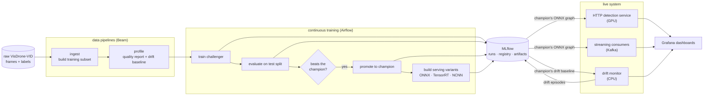
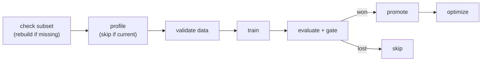

# mlops-cv — aerial object detection, end to end

> Developed with AI assistance (Claude Code).

A small, complete **MLOps platform for detecting objects in drone video**, that can be run on one machine with one GPU.
It follows Google's [MLOps level 2](https://docs.cloud.google.com/architecture/mlops-continuous-delivery-and-automation-pipelines-in-machine-learning)
pattern: models are retrained, tested, promoted, optimized, served, and watched **automatically**,
with a human deciding only what new data to admit.

The model is [YOLO26s](https://github.com/ultralytics/ultralytics) fine-tuned on the
[VisDrone-VID](https://docs.ultralytics.com/datasets/detect/visdrone) benchmark, detecting three
classes: **person**, **vehicle**, and **two-three-wheeler** (bikes, motorbikes, tricycles).

Everything is open source and runs locally in Docker Compose: MLflow, Airflow, Apache Beam,
Redpanda (Kafka), FastAPI + onnxruntime, Prometheus + Grafana.

## General scheme



## How it works

### 1. Data: raw video frames become a training set

- The **ingest pipeline** reads the raw VisDrone frames, keeps every Nth frame (video frames
  repeat a lot), merges the ten VisDrone categories into three classes, and writes a standard
  YOLO dataset. It also saves three full-rate **demo clips** used later for videos and streaming.
- The **profile pipeline** measures every frame (brightness, contrast, blur, duplicates) and
  writes a quality report plus a **drift baseline**: what "normal footage" looked like when the
  model was trained. The baseline is published to MLflow as a data version.
- Both are Apache Beam pipelines, so the same code can run on a laptop or on a managed runner
  such as Dataflow.

Details: [docs/data.md](docs/data.md), [docs/batch-pipeline.md](docs/batch-pipeline.md).

### 2. Training and evaluation: produce a model, then judge it

- **Training** fine-tunes YOLO26s from COCO weights on the subset. It logs parameters, per-epoch
  metrics, and the best weights to MLflow, and registers a new **model version**.
- **Evaluation** measures the model on the held-out test split (precision, recall, mAP50,
  mAP50-95, per class), renders demo videos with ground truth vs predictions, saves crops of the
  worst mistakes, and runs the **gate**.
- The **gate** is a simple rule: the new model must beat the current champion's mAP50-95 by a
  margin (default one point) and clear any minimum floors. If there is no champion yet, the first
  model wins by default.

Details: [docs/training.md](docs/training.md), [docs/evaluation.md](docs/evaluation.md).

### 3. Continuous training: Airflow runs the loop

An Airflow DAG runs weekly or when a *new training data* event arrives. Each heavy step runs in
its own Docker container with GPU access:



Optimization runs **only after a promotion**, because only the champion is ever served.

Details: [docs/orchestration.md](docs/orchestration.md).

### 4. Optimization: one model, several ways to run it

The same weights are exported to a portable **ONNX** graph, a compiled **TensorRT FP16** engine
for the GPU server, and **NCNN** models for an edge device (e.g., Raspberry Pi 5). Each variant is measured
for accuracy and latency on the same test split, every file is published to MLflow, and a report
is attached to the model version. No winner is picked automatically. The report is evidence, and
the choice depends on the target device.

Details: [docs/optimization.md](docs/optimization.md).

### 5. Serving: HTTP and streaming, one inference path

- The **detection service** is a FastAPI app. It downloads the champion's ONNX graph at startup,
  runs it on onnxruntime with CUDA, and answers `POST /predict` with boxes, class names, and
  confidences.
- The **streaming path** replays the demo clips onto a Kafka topic as if they were a live camera.
  An **inference consumer** runs the same detector on every frame and publishes detection events.
  An **anomaly consumer** watches those events and raises an alert when too many people appear in
  a time window.
- Both paths share one artifact and one pre/post-processing module, so an HTTP answer and a
  streamed answer are the same answer.

Details: [docs/serving.md](docs/serving.md), [docs/streaming.md](docs/streaming.md).

### 6. Monitoring: does today's footage look like the training footage?

A small CPU process samples frames from the stream, measures brightness, contrast, and blur, and
compares each window against the champion's drift baseline. Thresholds are derived from the
baseline at startup, so there is nothing to tune. Two drifted windows in a row open an **episode**,
which is logged to Grafana and recorded on the champion's MLflow run as evidence. A human then
decides whether to collect and label footage like that, which feeds the next training run.

Details: [docs/monitoring.md](docs/monitoring.md).

## Running it

### Prerequisites

- Linux, Python 3.12 via [uv](https://docs.astral.sh/uv/), Docker with Compose.
- An NVIDIA GPU for training, evaluation, optimization, and GPU serving. Developed on an
  8 GB RTX 5070. The data pipelines, the drift monitor, and the tests run on CPU.
- The VisDrone-VID dataset, downloaded and unzipped (see [docs/data.md](docs/data.md)).

Host GPU and Docker GPU setup: [docs/gpu-setup.md](docs/gpu-setup.md).

### Quickstart

```bash
make setup                 # create the venv and install dependencies
make ci                    # lint, format check, unit tests (what CI runs; CPU only)
make gpu-smoke             # prove torch really runs on your GPU

cp .env.example .env       # then set DATA__RAW_DIR, DATA__SUBSET_DIR, TRAINING__WEIGHTS
```

### The full loop, by hand

```bash
make ingest                # raw frames -> training subset + demo clips
make profile               # subset -> quality report + drift baseline (starts MLflow)
make train                 # train YOLO26s -> MLflow run + registered model version
make eval MODEL=runs:/<run_id>/weights/best.pt RUN_ID=<run_id>   # test metrics + gate + videos
make optimize              # export + benchmark serving variants for the champion
make serving-up            # detection service, consumers, drift monitor, Prometheus, Grafana
uv run python -m mlops_cv.streaming.producer --loops 1            # replay the demo clips
curl -F image=@frame.jpg 'localhost:8000/predict?conf=0.3'
```

Or let Airflow run the training part: `make airflow-up`, unpause the DAG at
http://localhost:8080, and trigger it.

### The stacks

Four Docker Compose stacks share one network. Each has `make <name>-up`, `-down`, and `-logs`.

| Stack | What is in it | Where to look |
|---|---|---|
| `mlflow` | tracking server, Postgres, RustFS (S3-compatible storage) | http://localhost:5000 |
| `airflow` | scheduler, API server, DAG processor, metadata DB | http://localhost:8080 (airflow / airflow) |
| `streaming` | Redpanda broker, Console, topic setup | http://localhost:8085 |
| `serving` | detection service, both consumers, drift monitor, Prometheus, Grafana, GPU exporter | http://localhost:8000, :3000, :9090 |

`make stack-up` starts all four in the right order. `make stack-down` stops them.

Details: [docs/containers.md](docs/containers.md).

## Repository layout

```
src/mlops_cv/
  config/         settings from .env + environment variables
  data/           VisDrone conversion, subset layout, dataset validation
  pipelines/      Beam pipelines: ingest and profile
  training/       YOLO26s training + MLflow logging
  evaluation/     metrics, gate, report, demo videos, error crops
  optimize/       serving variants (ONNX, TensorRT, NCNN) + benchmarks
  serving/        FastAPI detection service + pre/post-processing
  streaming/      Kafka producer and consumers, message schemas
  monitoring/     drift monitor + episode evidence
  tracking/       MLflow helpers: champion lookup, metric keys, record runs
  orchestration/  the contract between the Airflow DAG and its containers
dags/             Airflow DAGs
docker/           Dockerfiles
docker-compose/   the four stacks
observability/    Prometheus config + Grafana dashboards (as code)
configs/          dataset YAML, demo clip list
docs/             one page per component
tests/            unit tests (CPU) and integration tests (GPU / Docker, skipped in CI)
```

## Configuration

One `.env` file plus environment variables, with environment variables winning. Nested settings
use a double underscore, for example `MLFLOW__TRACKING_URI`. The same code runs locally and in the
cloud; only the values change. Details: [docs/config.md](docs/config.md).

## Documentation

Start at [docs/index.md](docs/index.md). Each component has its own page. The infrastructure pages
(MLflow, orchestration, data pipelines, streaming, containers) end with a *cloud migration* section
describing what changes when that piece moves to a managed service.
