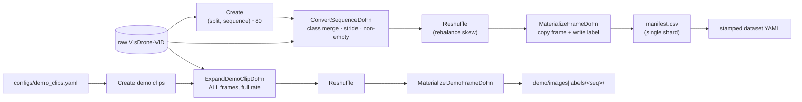
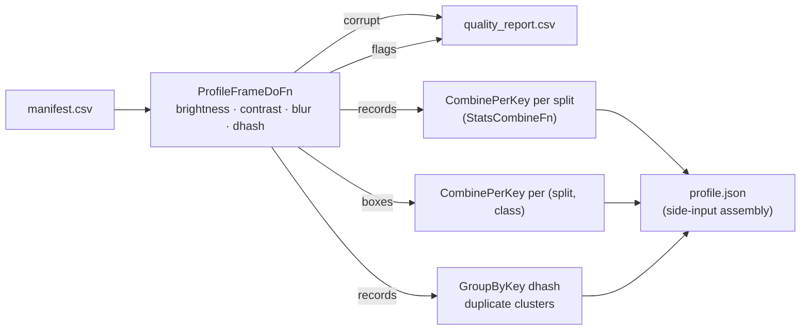

# Batch data pipelines (Apache Beam)

Two [Apache Beam](https://beam.apache.org/) pipelines own the dataset side of the continuous-
training loop: **ingestion** (raw dataset → the training subset + demo store) and
**profiling** (the subset → a dataset-quality report + the drift baseline). They are Beam
rather than scripts for **portability**: the identical `run()` executes on DirectRunner locally
and on any managed Beam runner in cloud (e.g. Dataflow on GCP, or a Flink/Spark cluster), and
every file operation goes through `apache_beam.io.filesystems.FileSystems`, so object-store
paths (`gs://`, `s3://`) work transparently.

## Ingestion: raw → subset + demo store



Keeps **every** sequence and shrinks by `--frame-stride` (default 20 — drops near-duplicate
consecutive video frames); only frames with at least one surviving box are materialized. The
annotation conversion (10→3 class merge, ignored-region dropping, box clipping) is the same
pure code the repo has always used ([data.md](data.md)).

Sequence length can and heavily skewed, so the pipeline converts
per-sequence, then **`Reshuffle()`** breaks fusion and redistributes the per-frame copy work
evenly across workers — without it, wall-clock is hostage to the longest sequence.

The **demo store** is the second output: for the clips in `configs/demo_clips.yaml` it copies
*all* frames (full frame rate, empty frames included, byte-identical) to
`demo/images/<sequence>/` with per-frame YOLO ground-truth labels under
`demo/labels/<sequence>/` (a missing label file means "no objects"). Evaluation renders demo
videos from this store — **the raw dataset is needed only by this pipeline**. Frames are stored
at original resolution; the renderer downscales at encode time.

## Profiling: subset → quality report + drift baseline



Per frame: grayscale **brightness/contrast** and a **blur score** (variance of the edge-filtered
image) via pillow, a **difference hash** (imagehash) for near-duplicate detection, and per-box
area/aspect stats from the labels. Aggregations are where Beam earns its keep: a custom
`CombineFn` (count/mean/std/min/max accumulators) per split and per class, plus a `GroupByKey`
on hashes for duplicate clusters, assembled into one JSON via side inputs.

Outputs under `<subset>/profile/`:

- **`profile.json`** — the dataset profile / **drift baseline**: per-split distributions of
  brightness/contrast/blur/boxes-per-frame, per-class box-area/aspect distributions, duplicate
  clusters, source-manifest hash. A monitoring component compares future data windows against
  this file before firing the retrain asset event.
- **`quality_report.csv`** — one row per flagged frame: `corrupt`, `dark`, `bright`,
  `low_contrast`, or `blurry` with the offending value. The thresholds are **informational**;
  duplicate clusters among strided frames of near-static scenes are expected.

The run **fails only when corrupt/unreadable images exist** — in that case the provenance stamp
is withheld, so the next orchestrated run re-profiles after the data is fixed.

## Provenance stamps (skip-if-current)

A completed profile writes `.profile-stamp.json`: the SHA-256 of the subset manifest plus the
profile parameters. The orchestration DAG checks it (`is_profile_current`) and **skips** the
profile task when nothing changed; any re-ingest rewrites the manifest and correctly invalidates
the stamp. The stamp is written last, so an interrupted run is never considered current.

## Run it

```bash
make ingest    # DATA__RAW_DIR -> DATA__SUBSET_DIR (+ demo store); Beam DirectRunner
make profile   # DATA__SUBSET_DIR -> <subset>/profile/{profile.json,quality_report.csv}
# explicit forms:
uv run python -m mlops_cv.pipelines.ingest_pipeline --runner DirectRunner \
  --raw-dir /data/VisDrone-VID --output-dir /data/subsets/visdrone-vid-small --frame-stride 20
uv run python -m mlops_cv.pipelines.profile_pipeline --runner DirectRunner \
  --input-dir /data/subsets/visdrone-vid-small

uv run python -m mlops_cv.data.validate   # the rebuilt subset stays a valid dataset
make test                                 # includes the Beam pipeline unit tests
```

In the continuous-training DAG both pipelines run as CPU `DockerOperator` siblings in the
`mlops-cv-beam` image — ingestion only as self-healing when the subset is missing/invalid,
profiling whenever the stamp is stale.

## Cloud migration

The cloud promotion is a **runner swap plus staging flags** — the same pipeline submits to any
managed Beam runner (`--runner DataflowRunner | FlinkRunner | SparkRunner`); nothing in the
pipeline bodies changes. Documented, not run locally — e.g. for a GCP-managed runner:

```bash
uv build   # dist/mlops_cv-0.1.0-py3-none-any.whl — ships the DoFn code to the workers
python -m mlops_cv.pipelines.ingest_pipeline \
  --runner DataflowRunner \
  --project <gcp-project> --region <region> \
  --temp_location gs://<bucket>/tmp \
  --extra_packages dist/mlops_cv-0.1.0-py3-none-any.whl \
  --raw-dir gs://<bucket>/raw/VisDrone-VID \
  --output-dir gs://<bucket>/datasets/visdrone-vid-small
```

Sequence matching, frame copies, the demo store, manifests, and stamps all go through
`FileSystems`, which resolves whatever scheme the paths carry (`gs://` above; `s3://` or HDFS
the same way) on the cloud runner. In managed Airflow the tasks are *submitted* via the
deferrable `BeamRunPythonPipelineOperator` instead of running a local container.
