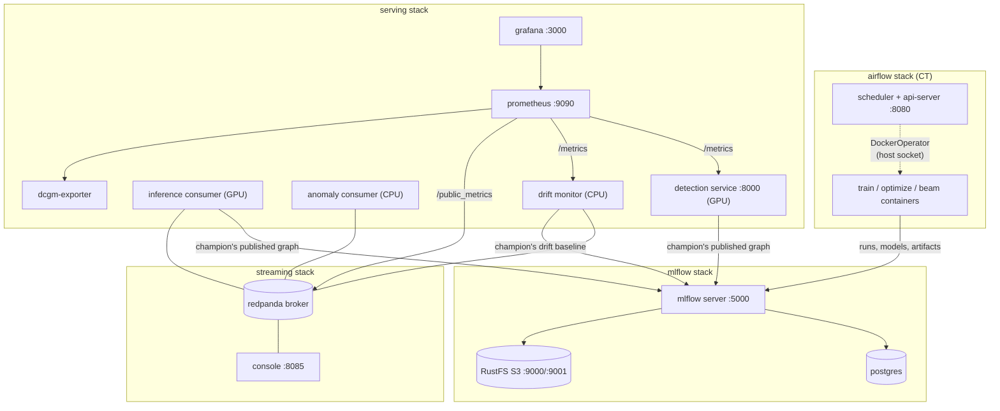

# Containers & Compose stacks

Everything in the platform runs as a pinned Docker image, composed into **four compose
stacks** on one shared network. This page is the container inventory: which images exist,
how they are built, and how the stacks fit together. GPU-in-Docker host setup lives in [gpu-setup.md](gpu-setup.md).

## Image inventory

First-party images, all built from the repo root with exact-pinned bases and the
committed `uv.lock`:

| Image | Dockerfile (target) | Base | uv groups | Runs |
|---|---|---|---|---|
| `mlops-cv-train` | `Dockerfile.cudnn-devel` (`train`) | CUDA 13.2 cudnn-**devel** | `gpu` | training + evaluation (the CT DAG's GPU tasks) |
| `mlops-cv-optimize` | `Dockerfile.cudnn-devel` (`optimize`) | CUDA 13.2 cudnn-**devel** | `gpu` + `optimize` | serving-variant export, compilation, benchmarking |
| `mlops-cv-serve` | `Dockerfile.cudnn-runtime` (`serve`) | CUDA 13.2 cudnn-**runtime** | `serving` | the HTTP detection service |
| `mlops-cv-stream` | `Dockerfile.cudnn-runtime` (`stream`) | CUDA 13.2 cudnn-**runtime** | `serving` + `streaming` | streaming consumers (command override) |
| `mlops-cv-beam` | `Dockerfile.beam` | `python:3.12-slim` | `beam` | Beam data pipelines (ingest, profile) |
| `mlops-cv-monitor` | `Dockerfile.monitor` | `python:3.12-slim` | `monitoring` | the drift monitor (no torch, no CUDA, no ONNX) |
| airflow image | `Dockerfile.airflow` | `apache/airflow:3.2.2-python3.12` | base deps + providers-docker + mlflow-skinny (pip) | scheduler / api-server / dag-processor / triggerer |
| mlflow image | `Dockerfile.mlflow` | `ghcr.io/mlflow/mlflow:v3.14.0` | — (adds psycopg2 + boto3) | the tracking server |

Third-party services (Postgres, RustFS, Redpanda + Console, Prometheus, Grafana, the DCGM
exporter) run their upstream images, tag-pinned in the compose files.

`make train-image / beam-image / optimize-image / serve-image / stream-image /
monitor-image` build the first-party images; the image tags are single-sourced in the
Makefile and exported to the compose files, so a stack can never launch a tag the Makefile
didn't build.

## The build pattern: opt-in dependency groups

Every first-party Python image follows one recipe: copy `.python-version` +
`pyproject.toml` + `uv.lock`, then

```dockerfile
RUN uv sync --locked --no-default-groups --group <exactly-what-this-image-needs>
```

Groups are **opt-in per image** — starting from `--no-default-groups` means a group added
to the project later can never silently leak into an existing image. (CI is the deliberate
opposite: it *subtracts* the GPU-only groups, so a new group's tests run there by
default.) Dependencies are synced before the source is copied, so the heavy venv layer
caches across code-only rebuilds.

## Stack topology

Four stacks, one shared external network (`mlops-cv-network`, created by the MLflow
stack). Service names are globally unique across stacks — compose registers each service
name as a network-wide DNS alias, so a duplicate would shadow another stack's service.



| Stack | Up / down / logs | Brings up first |
|---|---|---|
| MLflow (tracking + registry) | `make mlflow-up` … | — |
| Airflow (continuous training) | `make airflow-up` … | MLflow + train/beam images |
| Streaming (broker + topics) | `make streaming-up` … | MLflow |
| Serving (service + consumers + drift monitor + observability) | `make serving-up` … | Streaming + serve/stream/monitor images |
| Everything | `make stack-up` / `stack-down` | all of the above |

## Cloud migration

The images are the portable unit. The serving image is the eventual cloud deployment
artifact (a serverless GPU runtime pulls it unchanged — the champion is resolved through
`MLFLOW__TRACKING_URI`, the only credential). The stacks map onto managed mirrors
(tracking server → managed MLflow/metadata store, broker → managed Kafka or native
streaming, Prometheus/Grafana → managed monitoring) with the environment switch carrying
the addresses.
