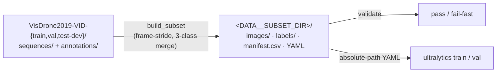

# VisDrone-VID dataset

A small, reproducible YOLO detection dataset built from the **VisDrone-VID** (video object
detection) benchmark: drone-captured video frames with the 10 raw object categories merged into 3.



## Download

The VID ZIPs are hosted on **Google Drive / Baidu Yun** (linked from the
[VisDrone-Dataset](https://github.com/VisDrone/VisDrone-Dataset) repo). Download `VisDrone2019-VID-train`,
`VisDrone2019-VID-val`, and `VisDrone2019-VID-test-dev`, unzip, and point the converter at the parent
directory. Each split is already a set of **extracted frames** (not video files):

```
<DATA__RAW_DIR>/
  VisDrone2019-VID-train/
    sequences/<seq>/0000001.jpg, 0000002.jpg, ...
    annotations/<seq>.txt
  VisDrone2019-VID-val/
    sequences/ ... · annotations/ ...
  VisDrone2019-VID-test-dev/
    sequences/ ... · annotations/ ...
```

Set the locations (via the `export` or `.env`):

```bash
export DATA__RAW_DIR=/abs/path/to/VisDrone-VID    # holds VisDrone2019-VID-{train,val,test-dev}/
export DATA__SUBSET_DIR=/abs/path/to/subset       # where build_subset writes
```

## Annotation format and 3-class merge

Each annotation line is comma-separated:

```
0:frame_index
1:target_id
2:bbox_left
3:bbox_top
4:bbox_width
5:bbox_height
6:score
7:object_category
8:truncation
9:occlusion
```

`bbox_*` are absolute pixels with `(left, top)` the top-left corner. In the **ground truth**,
`score` is `1` (counts) or `0` (ignored — skipped). The 10 raw categories collapse to 3:

| Merged class (id)        | VisDrone raw categories                                   |
|--------------------------|-----------------------------------------------------------|
| `person` (0)             | pedestrian (1), people (2)                                |
| `vehicle` (1)            | car (4), van (5), truck (6), bus (9)                      |
| `two-three-wheeler` (2)  | bicycle (3), tricycle (7), awning-tricycle (8), motor (10)|
| *dropped*                | ignored regions (0), others (11), and any `score == 0` row |

The third class is named `two-three-wheeler` because it includes the 3-wheeled tricycle and
awning-tricycle alongside the 2-wheeled bicycle and motor(cycle). Each surviving box is converted to
a YOLO line `<cls> <xc> <yc> <w> <h>` with the box **center** and size normalized to `[0, 1]` and
clipped to the frame.

## Ignored regions: dropped, not masked

VisDrone marks crowded / low-resolution areas as **ignored regions** (`category 0`, `score 0`) so
detections there are neither rewarded nor penalized during the official evaluation. This converter
**drops** those boxes (it does not paint the pixels out).

## Building the subset

```bash
uv run python -m mlops_cv.data.build_subset
uv run python -m mlops_cv.data.build_subset --frame-stride 10 --link
```

The builder shrinks the set with `--frame-stride N` — keeping every Nth frame to drop the near-duplicate
consecutive frames of a video. Flags:

- `--frame-stride N` — keep every Nth frame in train, val, and test splits (default 20).
- `--sequences NAME ...` — restrict to specific sequences (default: all) for a quick smoke.
- `--link` — symlink frames instead of copying (faster, same filesystem only).
- `--raw-dir / --out-dir / --template-yaml` — override the `Settings.data.*` defaults.

It writes a self-contained YOLO tree to `DATA__SUBSET_DIR` (default: `data/visdrone-vid-small`
inside the repo; any absolute path works — training, validation, evaluation, and the CT DAG all
read the same setting, and the directory's basename becomes the MLflow dataset name):

```
<DATA__SUBSET_DIR>/
  images/{train,val,test}/<seq>_<NNNNNNN>.jpg
  labels/{train,val,test}/<seq>_<NNNNNNN>.txt
  manifest.csv
  VisDrone-VID-merged.yaml
```

Point training/validation at generated YAML file:

```bash
yolo val model=yolo26s.pt data=<DATA__SUBSET_DIR>/VisDrone-VID-merged.yaml
```

The committed [`configs/datasets/VisDrone-VID-merged.yaml`](../configs/datasets/VisDrone-VID-merged.yaml)
is the human-readable source of truth for the class names.

## Validating the dataset

```bash
uv run python -m mlops_cv.data.validate     # exits non-zero on any failure
```

`validate_dataset()` aggregates every failure and either raises `DatasetValidationError` or returns
a `Report` whose `summary()` is a one-line string. It checks: train, val, and test splits non-empty; exact
image↔label pairing per split; every class id in `{0, 1, 2}`; every bbox coordinate in `[0, 1]` with
positive width/height; and each merged class present. The function is intended to be reused as a
fail-fast data-validation gate in the orchestration pipeline.

## Manifest

`manifest.csv` has one row per kept frame, for downstream dataset tracking and the
class-distribution check:

```
split,sequence,frame_index,image_relpath,label_relpath,width,height,n_boxes,n_person,n_vehicle,n_two_three_wheeler
```
