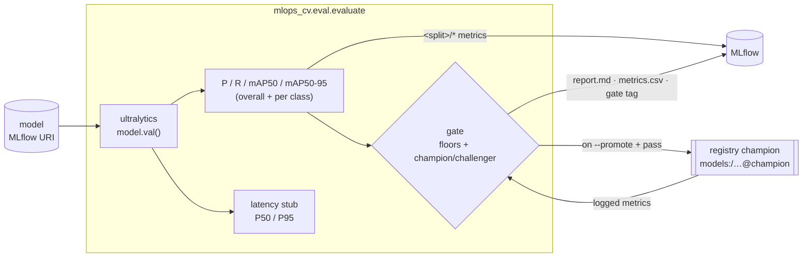

# Evaluation & benchmark harness

Evaluate a model from registry/run URI — on a dataset split and log a
reproducible report to MLflow: **precision, recall, mAP50, mAP50-95** (overall + per merged class),
a comparison table, a pass/fail **gate**, and a **latency** stub. The same harness is the baseline
for experiment comparison and the promotion gate for continuous training.



## Run it

```bash
# The champion (brings the MLflow stack up first):
make eval MODEL=models:/aerial-object-detector@champion
# or directly (the stack must be up — `make mlflow-up`):
uv run python -m mlops_cv.eval.evaluate --model models:/aerial-object-detector@champion --batch 8

# A specific run's checkpoint, with a metric floor:
uv run python -m mlops_cv.eval.evaluate --model runs:/<run_id>/weights/best.pt --min-map 0.2

# Promote the candidate to the champion alias if it passes the gate:
uv run python -m mlops_cv.eval.evaluate --model runs:/<run_id>/weights/best.pt --min-improvement 0.03 --promote
```

`--model` is an MLflow URI: a registry ref (`models:/<name>@<alias>`, `models:/<name>/<version>`) or a
run URI (`runs:/<id>/<path>`); the model's `best.pt` is downloaded automatically. The run logs to the server
named by `MLFLOW__TRACKING_URI`.

Useful flags: `--split` (default `test`), gate floors `--min-map/--min-map50/--min-precision/
--min-recall` (default `0.0`) + `--min-improvement` (challenger margin on `mAP50-95`, default
`0.01`), `--promote`, and `--no-latency`. The process exits `0` on a gate pass and `1` on a fail.

## What gets logged

| Logged | Source |
|---|---|
| `<split>/precision`, `recall`, `mAP50`, `mAP50-95` (overall + per merged class) | ultralytics `model.val()` |
| `gate/passed` metric + `gate.passed` / `gate.challenger_win` tags | the gate |
| `latency/p50_ms`, `p95_ms`, `mean_ms` | the latency stub |
| `report.md` (gate verdict + comparison + per-class + latency tables) | the report writer |
| `metrics.csv` (candidate + champion rows) | the report writer |

## The gate

The gate returns a single pass/fail from two parts:

1. **Absolute floors** — each of `--min-map/--min-map50/--min-precision/--min-recall` is a lower
   bound on the corresponding `<split>/*` metric (`>=`, boundary inclusive); all default to `0.0`
   (no floor).
2. **Champion / challenger** — the candidate's `mAP50-95` must beat the current champion's by at
   least `--min-improvement` (default `0.01`, ≈1 mAP point). The champion is the model version
   carrying the `champion` registry alias; its metrics are read from the run that produced it. With
   **no champion yet** (first model), this is a bootstrap win and only the floors apply.

`passed` is *all floors AND the challenger comparison*. The decision logic is a pure function, so the
continuous-training orchestrator can call it directly or branch on the `gate.passed` tag; the eval
process also mirrors it in its exit code. `--promote` sets the `champion` alias to the candidate on a
pass.

## Latency

`latency/*` is a **stub**: it times single-image `model.predict()` calls (batch 1, including pre/
post-processing) and reports P50/P95/mean in milliseconds, discarding warm-up calls. It is a quick
sanity number, not a rigorous serving benchmark (engine size, VRAM peak, P99, batched throughput
come later, with the optimized engines).
