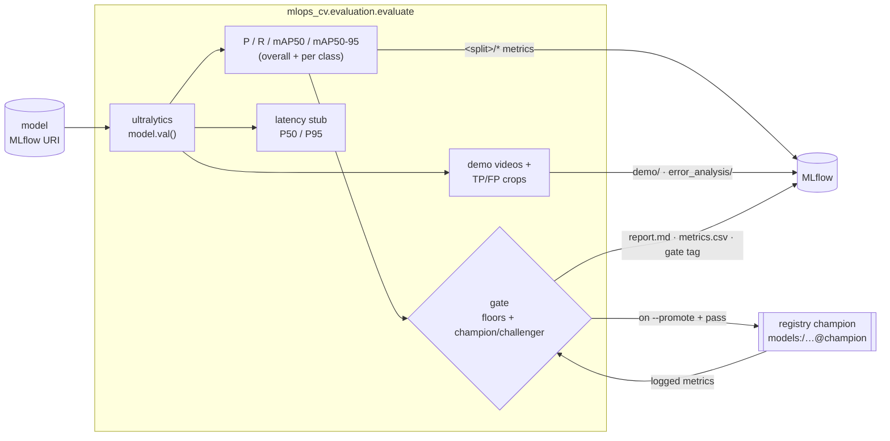

# Evaluation & benchmark harness

Evaluate a model from a registry/run URI on a dataset split and log a reproducible record to
MLflow: **precision, recall, mAP50, mAP50-95** (overall + per merged class), a comparison table, a
pass/fail **gate**, a **latency** stub, and the qualitative artifacts — three **demo videos** and
the **error-analysis crops**. The harness is the single quality-inspection surface: training
produces the model, evaluation measures and inspects it. The same harness is the baseline for
experiment comparison and the promotion gate for continuous training.



## Run it

```bash
# The champion (brings the MLflow stack up first):
make eval MODEL=models:/aerial-object-detector@champion
# or directly (the stack must be up — `make mlflow-up`):
uv run python -m mlops_cv.evaluation --model models:/aerial-object-detector@champion --batch 16

# Evaluate a fresh training run ONTO that run (one run = one model version's full record):
make eval MODEL=runs:/<run_id>/weights/best.pt RUN_ID=<run_id>

# Promote the candidate to the champion alias if it passes the gate:
uv run python -m mlops_cv.evaluation --model runs:/<run_id>/weights/best.pt --min-improvement 0.03 --promote
```

`--model` is an MLflow URI: a registry ref (`models:/<name>@<alias>`, `models:/<name>/<version>`) or a
run URI (`runs:/<id>/<path>`); the model's `best.pt` is downloaded automatically. The run logs to the server
named by `MLFLOW__TRACKING_URI`.

**Where the results land:** by default on a fresh `eval-<model>` run — an immutable audit record,
right for re-evaluating an existing model. With `--run-id <id>` the harness **resumes that run**
(typically the training run that produced the model) so its test metrics, report, and visuals sit
next to the training curves and the registered version's source.

Useful flags: `--split` (default `test`), gate floors `--min-map/--min-map50/--min-precision/
--min-recall` (default `0.0`) + `--min-improvement` (challenger margin on `mAP50-95`, default
`0.01`), `--promote`, and `--no-latency` / `--no-demos` / `--no-crops`. The process exits `0` on a
gate pass and `1` on a fail; `--exit-zero` forces `0` so an orchestrator can treat a challenger
loss as a branch, not a failure, and decide on the **verdict line** instead — the last stdout line
is machine-readable JSON: `{"passed": …, "candidate_primary": …, "champion_primary": …}`. The
verdict schema (`GateVerdict`) and the container command line are owned by the shared contract
module `mlops_cv.orchestration.handoff`, which both the emitter and the orchestrator import.

## What gets logged

| Logged | Source |
|---|---|
| `<split>/precision`, `recall`, `mAP50`, `mAP50-95` (overall + per merged class) | ultralytics `model.val()` |
| `gate/passed` metric + `gate.passed` / `gate.challenger_win` tags | the gate |
| `latency/p50_ms`, `p95_ms`, `mean_ms` | the latency stub |
| 3 demo videos (`demo/`) | the GT-vs-prediction renderer (below) |
| error-analysis crops (`error_analysis/`) | low-conf TP / high-conf FP picks (below) |
| `eval/report.md` (gate verdict + comparison + per-class + latency tables) | the report writer |
| `eval/metrics.csv` (candidate + champion rows) | the report writer |

The metric-key strings are authored once, in `mlops_cv.tracking.metric_keys`, and every producer
and reader (evaluation, the per-epoch training callback, the gate, the report) builds keys through
it.

## The gate

The gate returns a single pass/fail from two parts:

1. **Absolute floors** — each of `--min-map/--min-map50/--min-precision/--min-recall` is a lower
   bound on the corresponding `<split>/*` metric (`>=`, boundary inclusive); all default to `0.0`
   (no floor).
2. **Champion / challenger** — the candidate's `mAP50-95` must beat the current champion's by at
   least `--min-improvement` (default `0.01`, ≈1 mAP point). The champion is the model version
   carrying the `champion` registry alias; its metrics are read from the run that produced it. With
   **no champion yet** (first model), this is a bootstrap win and only the floors apply.

`passed` is *all floors AND the challenger comparison*. The decision logic is a pure function, so a
continuous-training orchestrator can call it directly or branch on the verdict line / `gate.passed`
tag; the eval process also mirrors it in its exit code (unless `--exit-zero`). `--promote` sets the
`champion` alias to the candidate on a pass.

## Demo videos

The renderer overlays **ground-truth** boxes (green) and **predictions** (red, with confidence) on
a fixed trio of held-out `test-dev` clips and encodes one `.mp4` each, logged under the run's
`demo/` artifacts. The clips are fixed (`configs/demo_clips.yaml`) so experiments stay visually
comparable, and were picked by per-class box counts so each clip stars a different class:

| Clip | Resolution | Stars |
|---|---|---|
| `uav0000161_00000_v` | 960×540 | two-three-wheeler (the rare class) |
| `uav0000355_00001_v` | 1360×765 | vehicle |
| `uav0000073_00600_v` | 1920×1080 | person (dense crowd) |

Frames and per-frame ground-truth labels come from the subset's **demo store**
(`<subset>/demo/`, materialized at full frame rate by the ingest pipeline — see
[batch-pipeline.md](batch-pipeline.md)), downscaled so the longest side is `≤ max_side` before
inference. Evaluation never reads the raw dataset. `fps` is playback speed only: VisDrone-VID
stores frames indexed by number, with no source video, timestamps, or capture rate, so the true
frame rate is not recoverable. Skip it with `--no-demos`; if the demo store is absent (subset
built without it), rendering warns and skips.

## Error-analysis crops

Two buckets of crops surface where the model is uncertain or wrong on the evaluated split, logged
under `error_analysis/`:

- **low-confidence true positives** — correct detections with the *smallest* confidence (near the
  decision boundary; candidates for threshold tuning or hard-example mining);
- **high-confidence false positives** — wrong detections with the *largest* confidence (the worst,
  most misleading errors, annotation issues).

Each pick is a padded, annotated crop (the box drawn with its class + confidence) indexed by
`segments.csv`. Predictions are labelled TP/FP by a greedy **per-class IoU matcher**: each prediction
(highest confidence first) claims the unused same-class ground-truth box of greatest IoU; `IoU ≥ 0.5`
is a TP (that GT is consumed), otherwise an FP. The matcher is qualitative **crop selection only** —
never AP math (metrics come exclusively from `model.val()`).

## Latency

`latency/*` is a **stub**: it times single-image `model.predict()` calls (batch 1, including pre/
post-processing) at the evaluated `--imgsz`/`--device` — so the number is comparable to the
accuracy it sits beside — and reports P50/P95/mean in milliseconds, discarding warm-up calls. It
is a quick sanity number, not a rigorous serving benchmark (engine size, VRAM peak, P99, batched
throughput come later, with the optimized engines).
