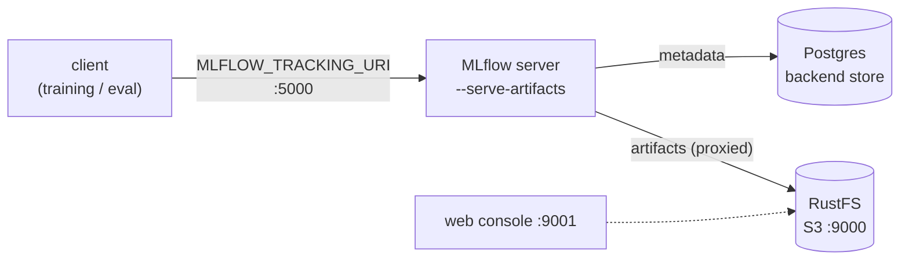

# MLflow tracking + registry

A local **experiment-tracking server** and **model registry**, run as a Docker Compose stack:
a Postgres backend store (required for the registry), an S3-compatible artifact store, and the
MLflow server. Training and evaluation log runs, metrics, and model versions here.



## Services & ports

| Service | Image | Port | Role |
|---------|-------|------|------|
| `mlflow` | `ghcr.io/mlflow/mlflow:v3.14.0` (+ psycopg2/boto3) | `5000` | tracking server + UI + registry |
| `postgres` | `postgres:15.18` | `5432` | backend store (registry needs a DB) |
| `storage` | `rustfs/rustfs:1.0.0-beta.8` | `9000` / `9001` | S3 artifact store / web console |
| `create-bucket` | `amazon/aws-cli:2.35.10` | — | one-shot: creates the `mlflow` bucket, then exits |

## Bring it up

```bash
docker compose -f docker-compose/docker-compose.mlflow.yml --env-file docker-compose/.env.mlflow up -d --build
# or: make mlflow-up   /   make mlflow-down   /   make mlflow-logs
```

Then validate:

```bash
# RustFS console: http://localhost:9001 (rustfsadmin / rustfsadmin) shows the "mlflow" bucket
curl http://localhost:5000/health  # -> OK
curl -X POST http://localhost:5000/api/2.0/mlflow/experiments/create \
  -H 'Content-Type: application/json' -d '{"name":"smoke"}'
# -> MLflow UI: http://localhost:5000 shows "smoke" experiment
```

The MLflow UI is at <http://localhost:5000>. The integration smoke
(`tests/integration/test_mlflow_stack.py`, marked `docker`) checks the same `/health` +
create-experiment path:

```bash
uv run pytest -m docker tests/integration/test_mlflow_stack.py
```

## Proxied artifacts (why clients stay simple)

The server runs with `--serve-artifacts` and owns `--artifacts-destination s3://mlflow`. It holds
the S3 endpoint and credentials and uploads artifacts to RustFS on the client's behalf, so a
**client needs only `MLFLOW_TRACKING_URI`** — no S3 endpoint, credentials, or `boto3`.
`mlops_cv.tracking.client` resolves that single variable from `Settings`:

> **In-network clients & the Host-header guard.** Containers on the compose network reach the
> server as `http://mlflow:5000`. MLflow validates the `Host` header against localhost + private
> IPs by default (DNS-rebinding protection) and rejects other hostnames with
> `403 Invalid Host header`, so the compose file sets
> `MLFLOW_SERVER_ALLOWED_HOSTS: localhost:5000,127.0.0.1:5000,mlflow:5000`. Add any new hostname
> a client uses (e.g. a cloud DNS name) to that list.

```python
from mlops_cv.tracking import client

client.configure()          # exports MLFLOW_TRACKING_URI into the environment
client.tracking_uri()       # "http://localhost:5000" (override with MLFLOW__TRACKING_URI)
client.experiment()         # "aerial-object-detection"
client.registered_model()   # "aerial-object-detector"
```

## Persistence & teardown

Backend metadata and artifacts persist in the named volumes `pgdata` and `rustfs-data`. To wipe
them (fresh start):

```bash
docker compose -f docker-compose/docker-compose.mlflow.yml --env-file docker-compose/.env.mlflow down -v
```

The credentials in `docker-compose/.env.mlflow` are **local-dev defaults, not secrets**.

## Cloud migration

The only client-visible switch between environments is `MLFLOW_TRACKING_URI` (via `MLFLOW__TRACKING_URI`
/ the `ENV` overlay). In the cloud the server moves to a managed runtime, the backend store becomes a
managed Postgres, and the artifact store becomes object storage — the `--serve-artifacts` design
means training and evaluation code does not change.
