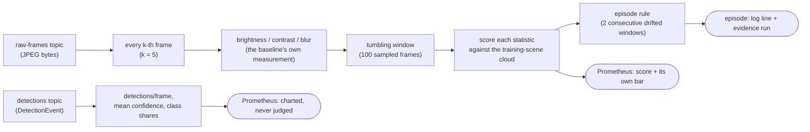
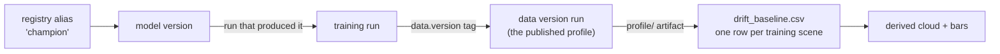
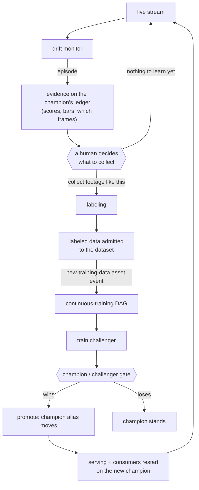

# Drift monitoring

One CPU process in the serving stack watches the live stream and answers a single question:
**does the footage arriving now look like the footage the champion was trained on?** When it
stops looking like it, the readings cross their bars, an episode opens, and the episode is
recorded as evidence on the champion's own ledger.

```bash
make serving-up      # the monitor comes up with the serving stack
make serving-logs    # every completed window logs its scores beside their bars
# http://localhost:3000 -> the "Drift" dashboard
```

## The data path



The monitor runs **no model** — no torch, no ONNX, no OpenCV. Its per-frame reading is pillow
and numpy, which is why its image is a fraction of the size of the inference consumer's.

## The statistic

Per window, per statistic: take the **mean**, and score it against the cloud of training-scene
means as a distance in that cloud's own standard deviations.

```
score = | window mean - mean of the training-scene means | / sd of the training-scene means
```

A window is **drifted when any single statistic exceeds its own bar** (strict — the widest
training scene reads as normal).

Two properties are load-bearing:

**Scene-level means, not distribution shape.** A live window is a narrow slice of *one* scene;
the training data is a mixture of many. Mean is unbiased at any window size, which is why
window size here is a noise parameter rather than a correctness one.

**Ratio-scale statistics are scored in log space** — `blur` today, and anything count- or
area-like added later. `blur` is variance-like with a hard floor at zero, so a symmetric score
caps downward detectability at `centre/sd` = 1.96, *below* the 2.36 bar a symmetric score derives:
the defocus that collapses the champion's detections by 86% moves blur 3499 → 90 and scores
**1.85–1.93 — no alarm, structurally impossible**. In log space the same shift scores 4.07–5.86
against a 3.20 bar while normal traffic sits at 0.56–1.32. Without that branch the monitor would
fire on the shift the model absorbs and stay silent on the one that breaks it.

## Thresholds are derived at startup, never written down

Each statistic's bar is **the widest distance any training scene itself reaches**, times a
margin (default 1.0). Derived from the published baseline when the monitor starts, so there is no
threshold to configure and none to go stale.

The numbers below are what the monitor computes at startup on the current subset:

```
training-scene cloud (56 scenes):   brightness 116.2 ± 25.3   contrast 46.3 ± 9.5   blur 1749 ± 890
derived bars (max z among scenes):  brightness 2.60           contrast 2.35         blur 3.20 (log)
```

Normal traffic peaks at 1.32 against a 2.35–3.20 bar.

> **Remeasure obligation.** These numbers describe *this* subset, sampling stride and set of
> statistics. Change any of them — a different subset, a different stride, a statistic added or
> renamed — and the bars move: re-derive them, re-run the demo, and update every number written
> down here and in the tests that pin them. This is the same rule the streaming anomaly
> threshold carries.

## Windows and the episode rule

| Name | Decision |
|---|---|
| Sampling | every 5th frame |
| Window | 100 sampled frames, **tumbling** |
| Episode | 2 consecutive drifted windows |
| Re-arm | after one clean window |

A `drift_window_age_seconds` gauge counts from startup and is computed at scrape time, so a
monitor whose stream died reads as **stalled** rather than as calm water. The prediction side
carries the same guard: a gauge nobody ages keeps exporting its last reading forever, and a dead
inference consumer would look like steady traffic.

The monitor **commits no offsets**. It produces nothing, so it needs no bookmark — and a
bookmark would actively harm it: a restart would resume mid-backlog, replay it at full speed and
publish scores for footage from hours ago with a freshly-zeroed window age. Never committing
keeps every restart a tail of what is happening now. (Consequence: broker-side consumer lag is
meaningless for this group, and the lag panels exclude it by name.)

## Where "normal" comes from

The baseline travels with the model, not with the deployment. It is resolved **once at startup**
— restart to pick up a promotion, exactly like the detection service and the streaming
consumers.



Each scene contributes one row: its frame count and its mean brightness/contrast/blur, computed
by the profiling pipeline over the **training** split only — val and test do not describe
"normal". See [batch-pipeline.md](batch-pipeline.md) for how it is produced and published.

**Every state that leaves nothing to judge against exits 2 naming the command that fixes it** —
no champion, a champion whose training run is gone, a training run with no data version, a data
version whose profile was deleted or predates the baseline, an empty baseline, and a baseline
that cannot yield bars (one scene, or scene means with no spread).

Two consequences worth stating plainly:

- **A promotion moves the reference.** Promoting a model trained on drifted data resets what
  "normal" means. That is correct — the new champion learned that world — but it means an
  episode is always relative to the champion of the moment.
- **The reference is a pointer.** Pruning a data version's run orphans the baseline of every
  model version that names it.

## What it exposes

| Metric | Type | Reading |
|---|---|---|
| `drift_score{statistic}` | gauge | the last window's distance from the cloud |
| `drift_threshold{statistic}` | gauge | that statistic's derived bar |
| `drift_windows_total{verdict}` | counter | windows judged, `ok` / `drifted` |
| `drift_episodes_total` | counter | episodes opened |
| `drift_episodes_unrecorded_total` | counter | episodes that fired but could not be recorded |
| `drift_frames_skipped_total` | counter | frames that could not be profiled |
| `drift_window_age_seconds` | gauge | seconds since the last completed window |
| `prediction_detections_per_frame` | gauge | charted, never judged |
| `prediction_mean_confidence` | gauge | charted, never judged |
| `prediction_class_share{cls}` | gauge | charted, never judged |
| `prediction_window_age_seconds` | gauge | seconds since the last detection-event window |

Every score is exported **beside its own bar**, because the on-call question is how close to the
bar the stream is running, not merely whether it crossed.

## Episode evidence

A Prometheus counter says *that* an episode happened and forgets it at the end of its retention;
the frames it covered are nowhere. So each episode is also recorded as one **step** on a MLflow record
run that is a **child of the champion's training run**, beside the optimization record — one
parent therefore reads *trained → priced → observed*.

| | |
|---|---|
| Metrics | `drift/<statistic>/score`, `drift/<statistic>/threshold`, `drift/n_crossed` |
| Artifact | `episodes/episode-NNNN.json` — the crossing scores, and the window's footage as one index span per clip |
| Tags | the model, its version, its training run, its data version |

What is stored is the **opening** window: that is what the fire-once rule reports and what the
retrospective question asks — when did this start, how bad was it then, which frames. How bad it
*got* is the live signal's job; re-recording every drifted window would make the ledger a second,
worse copy of the time series.

Three details that are deliberate:

- **The run is created and immediately terminated**, then appended to by id. `docker stop` sends
  SIGTERM, which runs no exit handler, so a held-open run would strand the child in RUNNING on
  the first stop — and a crashed monitor would be indistinguishable from a healthy one.
- **Episode steps continue across restarts**: startup reads the last step off `drift/n_crossed`,
  so a restarted monitor extends the series rather than overwriting it.
- **Recording is best effort and counted.** A tracking outage does not stop the monitor —
  an episode is the worst moment to also lose the live signal — but every unrecorded episode
  increments `drift_episodes_unrecorded_total`, so the loss is visible rather than silent.

Run count is bounded by **model versions**, not by monitor restarts, so a crash-looping monitor
litters nothing. A promotion re-parents the evidence for free.

## Running the demo

The producer can dial a labeled synthetic photometric shift into the stream, in two modes that
mean different things: `defocus` is **malignant** (it destroys the champion's detections) and
`brightness` is **benign** (the model absorbs it). The recipe live with the
producer in [streaming.md](streaming.md#simulating-drift).

Watching it end to end: normal traffic sits well under the bars, shifted traffic crosses on the
second window and the episode fires once, and the panels split — under `defocus` the charted
detection rate collapses while under `brightness` it stays inside the
normal band. **That split is the whole point of shipping both**: the input alarm reports
that the camera changed, and only the prediction panels beside it say whether the model minded.

**A demo writes real evidence.** The monitor cannot tell dialed footage from a fogged lens — that
is precisely why it is trustworthy — so a demo episode lands on the champion's ledger like any
other. Delete that record run afterwards if the ledger is meant to describe production only.

## What it cannot see

- **Only shifts larger than the training set's own scene-to-scene variation.** The bar is set at
  the most extreme aerial scene, which is a high bar. It catches a camera going
  dark or a lens fogging; it will not catch subtle degradation.
- **Blind to a shape change that leaves the mean alone.** The statistic compares averages; a
  window whose distribution widens or splits while keeping its mean scores zero.
- **Photometric only.** Lighting, exposure, weather, focus, camera changes — yes. Semantic shift
  (new classes, altitude change, highway → crowd) — no.
- **The prediction side never judges.** It is context for the input alarm, not a second alarm.

## The loop, and the human in it



The monitor's output is **evidence for a decision**, and the decision — what footage to
collect, what to pay to label, what to admit — is where the human stands. The admission step is
the asset event's only producer; the manual `POST` recipe in
[orchestration.md](orchestration.md) is what it looks like today.

## Configuration

| Setting | Default | Notes |
|---|---|---|
| `MONITORING__GROUP` | `drift-monitor` | its own consumer group, tailing from latest, committing nothing |
| `MONITORING__SAMPLE_EVERY` | `5` | profile every k-th frame |
| `MONITORING__WINDOW_FRAMES` | `100` | sampled frames per tumbling window |
| `MONITORING__CONSECUTIVE_WINDOWS` | `2` | drifted windows that open an episode |
| `MONITORING__THRESHOLD_MARGIN` | `1.0` | multiplies the **derived** bars; there is no threshold to set |
| `MONITORING__METRICS_PORT` | `9101` | scraped in-network; must match the serving stack's env file |

Lowering the margin forces episodes on normal traffic, which is a quick way to exercise the
recording path — on a throwaway consumer group, and delete the polluted record afterwards.

## Step-ups: named, not shipped

- **A drift library** (Evidently). Its dependency cost was measured and found
  harmless; it was dropped because the statistic it would compute — a two-sample distribution
  test — is not one this reference can support, and the statistic that survives is ~20 lines of
  numpy. The moment the training distribution is a **narrow, single-scene** one (a fixed
  installation, one production line), the two-sample test becomes the right instrument and the
  library becomes worth its keep.
- **Embedding-based drift** (an autoencoder or CLIP encoder plus an MMD test). It detects
  semantic shift the photometric statistics are blind to — and it needs a model and a reference
  embedding set inside a monitor whose entire structural claim is that it runs neither.
- **Thresholded per-camera prediction monitoring.** On a fixed-camera platform, a stream
  compared against its own history is the *primary* signal and needs no published baseline at
  all.
- **Alert rules.** The readings are shaped for alerting (score beside bar, episodes as a
  counter, an age gauge that reads stalled), but no rules ship.
