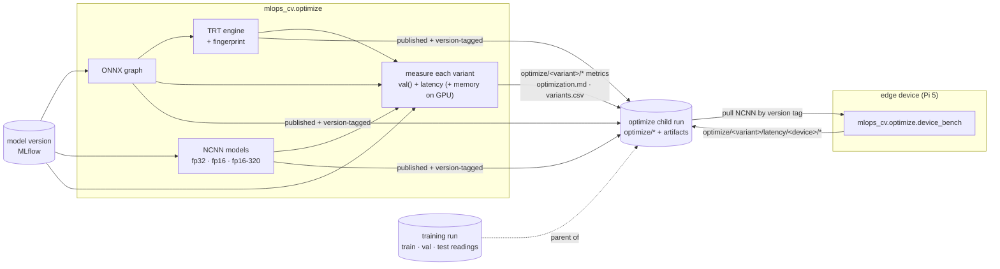

# Model optimization: serving variants

One trained model can be run several ways. This harness produces those **serving variants** —
the same weights expressed as a different runtime, numeric precision, and input resolution —
measures each for both accuracy and latency on the identical test split, publishes every
artifact to the model registry, and logs an optimization report onto a child of the model
version's tracking MLFlow run.

There are two deployment targets:

- **Server** — GPU machine that serves the streaming consumer.
- **Edge** — a **Raspberry Pi 5** (ARM CPU, no CUDA), reached over the LAN. Served by **NCNN**,
  the format the [ultralytics Raspberry Pi guide](https://docs.ultralytics.com/guides/raspberry-pi)
  measures fastest on that hardware.

The harness runs by hand against any model, and automatically in the continuous-training
pipeline whenever a model is promoted to champion.



## The variant ladder

| Rung | Target | What it isolates |
|---|---|---|
| `torch-fp32-640` | server | the baseline — should reproduce the evaluation harness's recorded reading |
| `onnx-ort-fp32-640` | server | the cost of leaving the training framework for a portable runtime |
| `trt-fp16-640` | server | the payoff of ahead-of-time compilation + reduced precision |
| `ncnn-fp32-640` | edge | the edge runtime at full precision — the accuracy anchor |
| `ncnn-fp16-640` | edge | half precision alone, resolution held constant |
| `ncnn-fp16-320` | edge | resolution alone, precision held constant |

## Run it

```bash
# The champion, whole ladder (brings the tracking stack up first):
make optimize

# A specific model, recorded on a child of its training run (what the pipeline does):
make optimize MODEL=runs:/<run_id>/weights/best.pt RUN_ID=<run_id>

# Iterate on one rung:
uv run python -m mlops_cv.optimize --variants trt-fp16-640
```

`--model` takes any MLflow model URI; with none, the champion alias is optimized — and if no
champion has been promoted yet - exits.
The pipeline passes the promoted version's own `runs:/` weights URI instead. `--run-id`
names the model version's training run — the record lands on a **child** of it, and
re-optimizing the same version reuses that child rather than adding a sibling. Without it the
record goes to a standalone `optimize-*` run. `--variants` filters the ladder; `--data` /
`--split` / `--device` mirror the evaluation harness.

### On the edge device

Accuracy is device-independent — the desktop measures it once. Latency is not: the Pi's numbers
can only come from the Pi. The on-device harness pulls each published NCNN artifact by the model
version's tags, times a predict loop over a small local image set, and logs onto the **same
record run** — found by following the artifact URI, so the device's latency lands beside the
accuracy it belongs with — under a device-labeled namespace:

```bash
python -m mlops_cv.optimize.device_bench --images bench-images   # champion, every NCNN variant
python -m mlops_cv.optimize.device_bench --model-version 2 --variants ncnn-fp16-320 \
    --device-label pi5 --images bench-images
```

It needs only `MLFLOW_TRACKING_URI` pointing at the tracking server and a directory of ~16
frames (copy once; any frames work). It records evidence and sets an
`optimize.measured.<device-label>` tag.

#### Raspberry Pi 5 setup

The uv lock is platform-specific (CUDA-13 torch pins), so the Pi runs a plain-pip venv:

```bash
python3 -m venv ~/.venvs/mlops-cv && source ~/.venvs/mlops-cv/bin/activate
pip install ultralytics==8.4.72 ncnn==1.0.20260526 mlflow-skinny==3.14.0
git clone <this repo> && pip install --no-deps -e mlops-cv
export MLFLOW_TRACKING_URI=http://<desktop-LAN-IP>:5000
```

`pip install torch` on aarch64 resolves a CPU wheel automatically (ultralytics drags it in).
Two LAN prerequisites, both already handled on the desktop side: port 5000 is published on all
interfaces, and the MLflow server's Host-header allowlist includes the private ranges —
`MLFLOW_SERVER_ALLOWED_HOSTS` *replaces* MLflow's default allowlist to add
`192.168.*,10.*`; without that, LAN calls fail with 403 "Invalid Host header".

## Every artifact is published

Everything the harness produces lands on the record run and is addressed from the registered
model version by tag, so a consumer resolves any serving artifact the same way it resolves the
champion's weights:

| Tag | Artifact |
|---|---|
| `optimize.onnx_640` | `onnx/best_640.onnx` — the portable graph |
| `optimize.trt_fp16_640` | `engines/trt-fp16-640.engine` |
| `optimize.trt_fp16_640_fingerprint` | `engines/trt-fp16-640.fingerprint.json` |
| `optimize.ncnn_fp32_640` / `…_fp16_640` / `…_fp16_320` | `ncnn/<variant>_ncnn_model/` |

with `optimization.md` and `variants.csv` at the artifact root.

An engine is still valid only for the GPU architecture and compiler version that built it — that
constraint is now expressed by the **fingerprint** (content hash, size, build arguments,
compiler version, GPU name, compute capability) travelling next to the binary, instead of by
withholding the binary. Anything pulling an engine must check the fingerprint against its own
hardware first. NCNN directories and ONNX graphs are
architecture-independent and travel freely — the Pi pulls its models straight from the registry.

## Where readings live

The record goes to a **child run** of the model version's training run, named `optimize` and
linked by MLflow's parent tag (the UI nests it under the parent).

Practically, a ladder produces about a dozen readings per rung — roughly 70 keys for six rungs,
plus 5 more per device label, and they accumulate forever: a rung retired today leaves its keys
behind. On the training run those would bury the two dozen readings that describe the model
itself (`train/*`, `val/*`, `test/*`, per-epoch `metrics/*`).

Within the record run every reading is namespaced: `optimize/<variant>/mAP50-95`,
`optimize/<variant>/latency/p50_ms`, `optimize/<variant>/speed/inference_ms`.

## How it is measured

- **Latency** is end-to-end single-image inference — pre-process, inference, post-process —
  because that is what a request or a streamed frame actually costs. A generous warm-up precedes
  a fixed timed run (compiled runtimes pay setup on their first calls), reported as P50/P95/P99.
- **`Infer ms`** is the library's own inference-only stage, recorded next to the end-to-end
  number so the gap between them is visible.
- **Edge-rung latency on the desktop is relative only.** It ranks the NCNN rungs against each
  other on the producing host's CPU; it says nothing about the deployment device. The device's
  numbers come from the on-device harness.
- **Memory** is read per-process through NVIDIA's management library, GPU rungs only (CPU rungs
  never touch the GPU and get no reading). The table reports what each variant **added**, not the
  process total.
- **Validation** runs at batch 1 for every variant, matching the single-image exports and
  keeping the rows comparable.

## In the continuous-training pipeline

The pipeline runs optimization **only after a promotion** — the champion is the only model that
will be served. The task is addressed exactly like evaluation:
by the training run's own weights URI, one identifier keying the whole
container chain.

## Production step-ups

- **Strongly-typed quantization.** TensorRT 11 removed the builder-level precision flags and the
  calibration interface, so precision must be baked into the graph beforehand — the export
  library routes both fp16 and int8 through NVIDIA ModelOpt to do it. Architecturally that is
  the better design. It is not used here because that toolkit pins the portable runtime back
  several releases, pulls a CUDA-12-flavoured dependency into a CUDA-13 environment, and is
  fetched by an install-at-runtime mechanism inside an image.
- **Tuning the portable runtime's memory.** The measured row uses stock session options, since
  that is what a service gets by default. Its memory-pattern planner and arena growth strategy
  are the two levers that matter, and neither is exposed through the export library's session
  construction.
- **Dynamic batching.** Everything here is fixed-shape, single-image. Batched serving is a
  throughput decision that needs throughput evidence, which belongs with a real service.
- **A dedicated inference server.** Compiled engines are what such a server consumes; it would
  pull them from the registry and validate the fingerprint on startup.
- **Quantization (int8), by any route.** NCNN has its own offline table tooling
  (`ncnn2table`/`ncnn2int8`) outside the export library's path; TensorRT has the ModelOpt route.
  There is no int8 rung today and no calibration machinery. Worth revisiting only if fp16 misses the latency
  budget. Needs a **calibration set** to fit activation scales.
  Never draw from the split the model's accuracy is reported on (the scales would be fitted to
  the images being scored).
