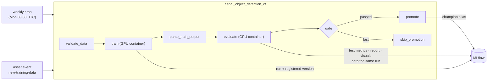

# Orchestration (Airflow continuous training)

An Airflow **3.2.2** stack (LocalExecutor, Docker Compose) runs the continuous-training loop as a
DAG: validate the dataset, train a challenger, evaluate it against the champion, and promote it to
the `champion` registry alias **only on a champion/challenger win**. The DAG fires weekly **or**
on an external *new data* asset event — the hook a drift monitor POSTs to close the
monitor → trigger → retrain loop.



## Run it

```bash
make airflow-up      # brings the MLflow stack up, builds the GPU train image, starts Airflow
# UI: http://localhost:8080 (user/password: airflow/airflow)
# teardown: make airflow-down; logs: make airflow-logs
# make airflow-env   # print the derived host wiring (paths + docker gid) for debugging
```

`make airflow-up` depends on the MLflow stack (shared Docker network + tracking server) and on
`make train-image` (the GPU image the DAG launches). DAGs start **paused**: trigger `smoke_test`
once to prove the stack executes tasks, then unpause/trigger `aerial_object_detection_ct`.

## Topology

| Service | Role |
|---|---|
| `airflow-postgres` | metadata DB (`postgres:15.18`; in-network only, no host port) |
| `airflow-init` | one-shot: dirs, DB migrations, admin user |
| `airflow-apiserver` | UI + REST + task-execution API (`:8080`) |
| `airflow-scheduler` | schedules **and runs** tasks (LocalExecutor) |
| `airflow-dag-processor` | parses DAG files (required standalone component in Airflow 3) |
| `airflow-triggerer` | event loop for deferrable operators |

**LocalExecutor** keeps the stack small — no redis/worker/flower; the scheduler runs the tasks.
That fits this single-machine, single-GPU setup: the DAG's in-process tasks are pure decisions,
and the heavy work is offloaded to Docker containers anyway.

Notable wiring (all in `docker-compose/docker-compose.airflow.yml` + `.env.airflow`):

- **Shared network.** The stack joins the external `mlops-cv-network` (created by the MLflow
  stack); services and task-launched containers reach the tracking server as `http://mlflow:5000`.
  Service names are unique across the two stacks (`airflow-postgres`, not `postgres`) to avoid
  DNS-alias collisions.
- **Task-execution API.** Airflow 3 task processes call back to the api-server;
  `AIRFLOW__CORE__EXECUTION_API_SERVER_URL` must point at `http://airflow-apiserver:8080/execution/`
  (the localhost default breaks inside containers).
- **JWT + Fernet.** The api-server signs tokens with `AIRFLOW__API_AUTH__JWT_SECRET` (shared by all
  components) and encrypts connections/variables with `AIRFLOW__CORE__FERNET_KEY`. Local throwaway
  values live in the committed `.env.airflow`; real deployments inject them from a secret manager.
- **Docker socket.** The scheduler mounts `/var/run/docker.sock` and joins the host's `docker`
  group (`group_add: DOCKER_GID`, derived by `make` from the host — the socket is `root:docker` and
  the container user isn't in that group). This lets `DockerOperator` launch **sibling** containers
  on the host daemon with GPU access — a **local-only** pattern; production swaps the operator for
  `KubernetesPodOperator` (or Cloud Composer's equivalent) without touching the surrounding DAG.

## The CT DAG

Every task is a thin wrapper over `mlops_cv` code — the DAG contains orchestration only:

1. **`validate_data`** (in-process) — `validate_dataset(...)` fails fast on schema/value skew
   before any GPU time is spent.
2. **`train`** (`DockerOperator`, GPU) — `python -m mlops_cv.training.train` in the
   `mlops-cv-train` image: trains, logs to MLflow, registers a challenger version. Its last stdout
   line — `{"version", "run_id"}` — becomes the task's XCom.
3. **`parse_train_output`** (in-process) — parses that JSON for downstream templating.
4. **`evaluate`** (`DockerOperator`, GPU) — `python -m mlops_cv.eval.evaluate --run-id <train run>
   --exit-zero`: logs the held-out test metrics, comparison report, gate, and the qualitative
   artifacts **onto the training run** (one run = one model version's full record; see
   [evaluation.md](evaluation.md)). `--exit-zero` keeps a challenger loss from failing the task —
   the verdict is data, not an error. Its last stdout line is the gate-verdict JSON.
5. **`gate`** (branch, in-process) — pure JSON check on the verdict: `promote` or `skip_promotion`.
6. **`promote`** (in-process) — points the `champion` registry alias at the challenger version.

Task containers get the host's dataset directories bind-mounted **at the same absolute path**
("path parity"), so the absolute `path:` stamped into the generated dataset YAML resolves
in-container unchanged: the subset (`HOST_SUBSET_DIR`) and the pretrained-weights directory
(`HOST_WEIGHTS`'s parent) read-write, and the raw dataset directory (`HOST_RAW_DIR`) read-only for
demo-video rendering — leave the latter empty to skip demos.

The four machine-specific values — `HOST_SUBSET_DIR` (reused from `DATA__SUBSET_DIR` in your local
`.env`; **required**), `HOST_WEIGHTS` (reused from `TRAINING__WEIGHTS`; **required**),
`HOST_RAW_DIR` (reused from `DATA__RAW_DIR`), and `DOCKER_GID` (the host `docker` group) — are
**derived and exported by `make airflow-up`**, so none is committed. `make airflow-env` prints the
resolved values. Invoking `docker compose` directly without exporting
`HOST_SUBSET_DIR`/`HOST_WEIGHTS`/`DOCKER_GID` **fails loudly** with a hint, rather than silently
mounting the wrong path.

## Scheduling: cron + asset events

The DAG uses `AssetOrTimeSchedule`: a weekly `CronTriggerTimetable` **or** an update to the
`new-training-data` asset. Any producer can fire the asset externally through the REST API — a
drift monitor, a data-ingest job, or you:

> **Enable the DAG first.** It ships **paused** (`DAGS_ARE_PAUSED_AT_CREATION=true`, so a newly
> parsed CT DAG never auto-starts a GPU run). While paused, neither the weekly cron nor an asset
> event schedules it — the event is *recorded* but creates zero runs. Unpause it once (toggle it
> in the UI at `localhost:8080`, or `docker exec airflow-scheduler airflow dags unpause
> aerial_object_detection_ct`) before triggering.

```bash
BASE=http://localhost:8080
# 1) JWT (FAB auth manager):
TOKEN=$(curl -s -X POST "$BASE/auth/token" -H "Content-Type: application/json" \
  -d '{"username": "airflow", "password": "airflow"}' | python3 -c "import sys,json;print(json.load(sys.stdin)['access_token'])")
# 2) The asset id:
ASSET_ID=$(curl -s "$BASE/api/v2/assets?name_pattern=new-training-data" \
  -H "Authorization: Bearer $TOKEN" | python3 -c "import sys,json;print(json.load(sys.stdin)['assets'][0]['id'])")
# 3) Post the event -> the CT DAG triggers:
curl -s -X POST "$BASE/api/v2/assets/events" -H "Authorization: Bearer $TOKEN" \
  -H "Content-Type: application/json" -d "{\"asset_id\": $ASSET_ID}"
```

## Cloud migration

The DAG is environment-agnostic — the graph, the XCom handoff,
and the branch don't change between local and cloud. Only the infrastructure under it swaps:

- **The self-run stack becomes managed Airflow** (e.g. Cloud Composer): the scheduler,
  dag-processor, triggerer, api-server, workers, and metadata DB are provided for you — you upload
  DAGs to a bucket. The `redis`/`worker`/`flower` that LocalExecutor omits never resurface (they are
  the managed service's internal concern, or replaced by a Kubernetes executor).
- **The GPU tasks swap `DockerOperator` → `KubernetesPodOperator`**.
  Each `train`/`evaluate` task becomes a pod on
  a GPU node pool. It is isolated to the operator definition; the surrounding DAG is untouched.
- **MLflow is reached over a cloud endpoint** injected as an env var / secret instead of Docker DNS,
  selected by the `ENV` config switch.
