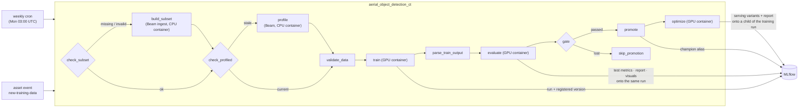

# Orchestration (Airflow continuous training)

An Airflow **3.2.2** stack (LocalExecutor, Docker Compose) runs the continuous-training loop as a
DAG: ensure the dataset exists and is valid (rebuilding it from raw via the Beam **ingestion**
pipeline if not), **profile** it (quality report + drift baseline, skipped when already up to
date — see [batch-pipeline.md](batch-pipeline.md)), validate what training will consume, train a
challenger, evaluate it against the champion, promote it to the `champion` registry alias
**only on a champion/challenger win**, and — only then — build and benchmark its serving variants.
The DAG fires weekly **or** on an external *new data* asset event — the hook whatever admits new
labeled data POSTs when the dataset actually changes.



## Run it

```bash
make airflow-up      # brings the MLflow stack up, builds the GPU train image, starts Airflow
# UI: http://localhost:8080 (user/password: airflow/airflow)
# teardown: make airflow-down; logs: make airflow-logs
# make airflow-env   # print the derived host wiring (paths + docker gid) for debugging
```

`make airflow-up` depends on the MLflow stack (shared Docker network + tracking server), on
`make train-image` (the GPU image the DAG launches), and on `make beam-image` (the CPU data-prep
image for the ingestion and profiling tasks). DAGs start **paused**: unpause/trigger
`aerial_object_detection_ct` from the UI.

## Topology

| Service | Role |
|---|---|
| `airflow-postgres` | metadata DB (`postgres:15.18`; in-network only, no host port) |
| `airflow-init` | one-shot: dirs, DB migrations, admin user |
| `airflow-apiserver` | UI + REST + task-execution API (`:8080`) |
| `airflow-scheduler` | schedules **and runs** tasks (LocalExecutor) |
| `airflow-dag-processor` | parses DAG files (required standalone component in Airflow 3) |
| `airflow-triggerer` | event loop for deferrable operators |

**LocalExecutor** keeps the stack small — no redis/worker/flower; the scheduler runs the tasks.
That fits this single-machine, single-GPU setup: the DAG's in-process tasks are pure decisions,
and the heavy work is offloaded to Docker containers anyway.

Notable wiring (all in `docker-compose/docker-compose.airflow.yml` + `.env.airflow`):

- **Shared network.** The stack joins the external `mlops-cv-network` (created by the MLflow
  stack); services and task-launched containers reach the tracking server as `http://mlflow:5000`.
  Service names are unique across the two stacks (`airflow-postgres`, not `postgres`) to avoid
  DNS-alias collisions.
- **Task-execution API.** Airflow 3 task processes call back to the api-server;
  `AIRFLOW__CORE__EXECUTION_API_SERVER_URL` must point at `http://airflow-apiserver:8080/execution/`
  (the localhost default breaks inside containers).
- **JWT + Fernet.** The api-server signs tokens with `AIRFLOW__API_AUTH__JWT_SECRET` (shared by all
  components) and encrypts connections/variables with `AIRFLOW__CORE__FERNET_KEY`. Local throwaway
  values live in the committed `.env.airflow`; real deployments inject them from a secret manager.
- **Docker socket.** The scheduler mounts `/var/run/docker.sock` and joins the host's `docker`
  group (`group_add: DOCKER_GID`, derived by `make` from the host — the socket is `root:docker` and
  the container user isn't in that group). This lets `DockerOperator` launch **sibling** containers
  on the host daemon with GPU access — a **local-only** pattern; production swaps the operator for
  `KubernetesPodOperator` (or Cloud Composer's equivalent) without touching the surrounding DAG.

## The CT DAG

Every task is a thin wrapper over `mlops_cv` code — the DAG contains orchestration only:

1. **`check_subset`** (branch, in-process) — validates the source subset (including its demo
   store); on missing/invalid it self-heals via `build_subset`, otherwise jumps ahead to
   `check_profiled`.
2. **`build_subset`** (`DockerOperator`, CPU, `mlops-cv-beam` image) — the Beam **ingestion
   pipeline** (`python -m mlops_cv.pipelines.ingest_pipeline`, DirectRunner): rebuilds the
   subset **and its demo store** from the raw dataset (requires `HOST_RAW_DIR`; the raw
   directory is mounted read-only into this task only). Airflow↔Beam
   handoff: Airflow decides *when* a pipeline runs; Beam parallelizes *the work inside it*.
3. **`check_profiled`** (branch, in-process) — compares the profile's provenance stamp (source
   manifest hash + profile parameters) against the subset; **skips the profile task when up to
   date**.
4. **`profile`** (`DockerOperator`, CPU, `mlops-cv-beam` image) — the Beam **profiling
   pipeline** (see [batch-pipeline.md](batch-pipeline.md)): per-frame quality metrics,
   dataset-level aggregations, and the drift baseline. Fails **only** on corrupt/unreadable
   images; statistical flags are informational rows in the quality report.
5. **`validate_data`** (in-process) — `validate_dataset(...)` fails fast on schema/value skew
   before any GPU time is spent.
6. **`train`** (`DockerOperator`, GPU) — `python -m mlops_cv.training` in the
   `mlops-cv-train` image: trains, logs to MLflow, registers a challenger version. Its last
   stdout line — the `TrainHandoff` line `{"version", "run_id"}` — becomes the task's XCom.
7. **`parse_train_output`** (in-process) — parses that handoff line for downstream templating.
8. **`evaluate`** (`DockerOperator`, GPU) — `python -m mlops_cv.evaluation --run-id <train run>
   --exit-zero`: logs the held-out test metrics, comparison report, gate, and the qualitative
   artifacts **onto the training run** (one run = one model version's full record; see
   [evaluation.md](evaluation.md)). Demo videos render from the subset's demo store — no raw
   data involved. `--exit-zero` keeps a challenger loss from failing the task — the verdict is
   data, not an error. Its last stdout line is the `GateVerdict` JSON.
9. **`gate`** (branch, in-process) — pure verdict-line check: `promote` or `skip_promotion`.
10. **`promote`** (in-process) — points the `champion` registry alias at the challenger version.
11. **`optimize`** (`DockerOperator`, GPU) — `python -m mlops_cv.optimize --model
    runs:/<train run>/weights/best.pt --run-id <train run>` in the `mlops-cv-optimize` image:
    builds and benchmarks the serving variants and publishes every artifact, recording them on a
    **child** of the training run (see [optimization.md](optimization.md)). Runs **only after a
    promotion** — the champion is the only model that gets served, so it is the only model that
    earns the GPU minutes.

### The container contract

The DAG↔container seam is owned by one module — `mlops_cv.orchestration.handoff` — imported by
both ends. The DAG builds every container command with it (`train_cmd`, `evaluate_cmd`,
`ingest_cmd`, `profile_cmd`); standing policy is the module's body — `--exit-zero`, the
DirectRunner choice, deriving the model under test from the training run
(`best_weights_uri(run_id)` → `runs:/<id>/weights/best.pt`) — and the DAG passes only per-run
values (some of them Airflow Jinja templates, rendered before the container starts). The replying
entrypoints emit their last stdout line through the same module's payload models: train's
`TrainHandoff`, evaluate's `GateVerdict`. Parsing tolerates unknown JSON keys, because the
Airflow and task images are built separately and may skew.

The two tasks that *join* the graph after a branch — `check_profiled` and `validate_data` —
carry `trigger_rule="none_failed_min_one_success"`: with the default `all_success` a skipped
upstream path (subset already valid, profile already current) would cascade the skip through the
rest of the DAG.

Task containers get the host's dataset directories bind-mounted **at the same absolute path**
("path parity"), so the absolute `path:` stamped into the generated dataset YAML resolves
in-container unchanged: the subset directory (`HOST_SUBSET_DIR` — including its `demo/` store
and `profile/` outputs) and the pretrained-weights directory (`HOST_WEIGHTS`'s parent)
read-write, and the raw dataset directory (`HOST_RAW_DIR`) read-only **into the `build_subset`
task only** — leave it empty if the subset (with demo store) already exists; the self-heal
rebuild then fails if ever needed. `make airflow-up` **pre-creates the subset directory**
(user-owned) so every bind mount has an existing source — the daemon rejects a `DockerOperator`
mount whose source path is missing.

The machine-specific values — `HOST_SUBSET_DIR` (reused from `DATA__SUBSET_DIR` in your local
`.env`; **required**), `HOST_WEIGHTS` (reused from `TRAINING__WEIGHTS`; **required**),
`HOST_RAW_DIR` (reused from `DATA__RAW_DIR`), and `DOCKER_GID`
(the host `docker` group) — are **derived and exported by `make airflow-up`**, so none is
committed. The image tags `TRAIN_IMAGE`/`BEAM_IMAGE` are exported from the same place — the
Makefile is their **single source**.
`make airflow-env` prints all resolved values. Invoking `docker compose`
directly without exporting them **fails loudly** with a hint, rather than silently mounting the
wrong path or launching a stale image.

## Scheduling: cron + asset events

The DAG uses `AssetOrTimeSchedule`: a weekly `CronTriggerTimetable` **or** an update to the
`new-training-data` asset. The asset means *the dataset changed*, so its producer is whatever
admits new data — a data-ingest job, a labeling handoff, or you:

> **Enable the DAG first.** It ships **paused** (`DAGS_ARE_PAUSED_AT_CREATION=true`, so a newly
> parsed CT DAG never auto-starts a GPU run). While paused, neither the weekly cron nor an asset
> event schedules it — the event is *recorded* but creates zero runs. Unpause it once (toggle it
> in the UI at `localhost:8080`, or `docker exec airflow-scheduler airflow dags unpause
> aerial_object_detection_ct`) before triggering.

```bash
BASE=http://localhost:8080
# 1) JWT (FAB auth manager):
TOKEN=$(curl -s -X POST "$BASE/auth/token" -H "Content-Type: application/json" \
  -d '{"username": "airflow", "password": "airflow"}' | python3 -c "import sys,json;print(json.load(sys.stdin)['access_token'])")
# 2) The asset id:
ASSET_ID=$(curl -s "$BASE/api/v2/assets?name_pattern=new-training-data" \
  -H "Authorization: Bearer $TOKEN" | python3 -c "import sys,json;print(json.load(sys.stdin)['assets'][0]['id'])")
# 3) Post the event -> the CT DAG triggers:
curl -s -X POST "$BASE/api/v2/assets/events" -H "Authorization: Bearer $TOKEN" \
  -H "Content-Type: application/json" -d "{\"asset_id\": $ASSET_ID}"
```

## Cloud migration

The DAG is environment-agnostic — the graph, the XCom handoff,
and the branch don't change between local and cloud. Only the infrastructure under it swaps:

- **The self-run stack becomes managed Airflow** (e.g. Cloud Composer): the scheduler,
  dag-processor, triggerer, api-server, workers, and metadata DB are provided for you — you upload
  DAGs to a bucket. The `redis`/`worker`/`flower` that LocalExecutor omits never resurface (they are
  the managed service's internal concern, or replaced by a Kubernetes executor).
- **The GPU tasks swap `DockerOperator` → `KubernetesPodOperator`**.
  Each `train`/`evaluate` task becomes a pod on
  a GPU node pool. It is isolated to the operator definition; the surrounding DAG is untouched.
- **The Beam tasks (`build_subset`, `profile`)** - see [batch-pipeline.md](batch-pipeline.md).
- **MLflow is reached over a cloud endpoint** injected as an env var / secret instead of Docker DNS,
  selected by the `ENV` config switch.
