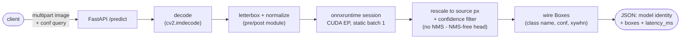
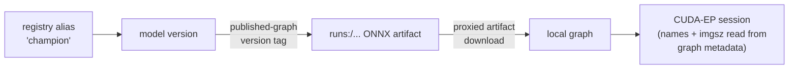

# The HTTP detection service

A FastAPI service answering single-image detection requests with the **champion model's
published ONNX graph** on onnxruntime's CUDA execution provider. It is the network face
of the platform: the same artifact, pre/post math, class names, and confidence floor as
the streaming inference consumer, so every served prediction — HTTP or bus — carries the
accuracy and latency the optimization report measured for the `onnx-ort` rung.

```bash
make serve            # host venv, champion's graph, http://localhost:8000
make serving-up       # or containerized, with the consumers + observability
curl -F image=@frame.jpg 'localhost:8000/predict?conf=0.3'
```

## Request path



And once, at startup:



## Where the model comes from

The service resolves the champion **once at startup**:

1. The registry's `champion` alias names the model version.
2. The version's `optimize.onnx_640` tag carries the full `runs:/…` URI of the ONNX
   graph the optimization harness exported and published for that version.
3. The artifact downloads through the tracking server's proxied artifacts — the only
   credential the service needs is `MLFLOW__TRACKING_URI`.
4. An onnxruntime session is built **CUDA-EP only** and asked back which providers it
   actually got: onnxruntime silently drops an unavailable provider, and a silent CPU
   fallback would invalidate every measured latency number. No CUDA, no service.

**Rollout = restart.** Promote a new champion, restart the service (or consumer), and it
serves the new version — responses and detection events carry `model.name`/`model.version`,
so the changeover is attributable. Hot-reload is a documented step-up for platforms where
restarts are expensive.

**Class names and input size come from the graph itself** — the exporter embeds them in
the ONNX metadata, and the service reads them off the loaded session rather than
configuring them beside the model.

## The pre/post contract

The graph is the exported **end2end NMS-free head**: it takes one letterboxed tensor and
returns final detections, so serving-side math is decode → letterbox → normalize on the
way in, and box rescale + confidence filter on the way out — **no NMS**.

That math lives in one owned pure module (numpy + headless OpenCV) and is pinned
**byte-for-byte** against golden fixtures generated with real ultralytics preprocessing.

## API

| Endpoint | Method | Purpose |
|---|---|---|
| `/health` | GET | status + loaded model name/version + input size |
| `/predict` | POST | multipart `image` upload → detections; `conf` query (0–1) overrides the default confidence floor per request |
| `/metrics` | GET | Prometheus metrics (request rate, latency histograms, errors) |

`/predict` response:

```json
{
  "model": {"name": "aerial-object-detector", "version": "3"},
  "boxes": [
    {"cls": "vehicle", "conf": 0.87, "xywhn": [0.512, 0.334, 0.041, 0.028]}
  ],
  "latency_ms": 26.5
}
```

Boxes reuse the streaming wire contract's `Box`/`ModelInfo` models — merged class names,
confidence, and normalized center-xywh — so HTTP and Kafka consumers share one detection
vocabulary.

## Observability

The serving stack ships a provisioned observability trio (see
[containers.md](containers.md) for the stack layout):

- **Prometheus** (`:9090`) scrapes four targets: the service's `/metrics`,
  the drift monitor's readings (per-statistic score and bar, window age, episodes),
  Redpanda's `/public_metrics` (broker health +
  consumer-group lag — the lag gauges are opt-in cluster config, enabled by the streaming
  stack's init), and a DCGM exporter (GPU utilization / VRAM / temperature).
- **Grafana** (`:3000`) is provisioned entirely from the committed `observability/` directory: the datasource
  and four dashboards — serving (rate, latency quantiles, errors), GPU, streaming
  (throughput, consumer lag), and drift (each statistic's score against its own derived
  bar, episodes, window age, and prediction health).
  UI edits don't persist by design; the files are the source of truth.

## Step-up: Triton Inference Server

`nvcr.io/nvidia/tritonserver:26.04-py3` is the named growth path, documented rather than shipped.

**What it replaces:** the FastAPI process. Triton is a dedicated inference server —
scheduling, batching, and instrumentation move out of application code into the server;
clients speak Triton's HTTP/gRPC protocol.

**What it consumes:** the published artifacts, straight from the registry. The
optimization harness publishes every variant — the portable ONNX graph *and* the compiled
TensorRT engines — each engine with a fingerprint sidecar (ONNX sha, TensorRT version,
GPU name, SM). A Triton model repository would be assembled from those artifacts at
deploy time, **checking the fingerprint against the target GPU before loading an
engine** — a compiled engine is only valid on the stack it was built for.

**What it buys:** dynamic batching (batching concurrent requests into one GPU pass),
concurrent model execution (several models or instances on one GPU with explicit VRAM
control), per-model versioned rollout, and server-grade Prometheus metrics for free.
