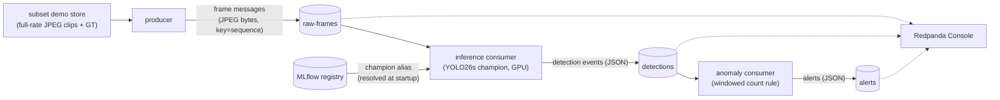

# Streaming inference (Redpanda + Kafka)

Real-time video inference over Kafka-compatible broker: a **producer** replays the
subset's demo store as a live-like camera feed, a **GPU inference consumer** serves the
champion model and publishes one detection event per frame, and an **anomaly consumer**
watches those events through a windowed count rule and raises alerts. Everything is
observable end-to-end in Redpanda Console.



## Quick start

```bash
# MLflow stack + Redpanda + Console + topic init
# Console UI at http://localhost:8085
make streaming-up
# teardown: make streaming-down; logs: make streaming-logs

# Terminal 1 — the anomaly watcher (tail mode):
uv run python -m mlops_cv.streaming.anomaly_consumer

# Terminal 2 — GPU inference on the champion (start consumers BEFORE producing):
uv run python -m mlops_cv.streaming.inference_consumer

# Terminal 3 — replay the demo clips as a 30 fps camera:
uv run python -m mlops_cv.streaming.producer --loops 1
```

The producer needs the subset's demo store (`make ingest` builds it); it fails with that
hint if the store is absent. The inference consumer needs the MLflow stack (champion
resolution) and the GPU.

## Topics & message contracts

Topics are provisioned by a one-shot `rpk` init service — broker auto-creation stays off.

| Topic | Partitions | Value | Key | Notes |
|---|---|---|---|---|
| `raw-frames` | 3 | JPEG bytes verbatim | sequence | `max.message.bytes` raised to 4 MiB; metadata in headers (`frame_index`, `ts_ms`) |
| `detections` | 3 | detection event JSON | sequence | co-partitioned with frames |
| `alerts` | 1 | alert JSON | sequence | episode-scoped |

All payloads are owned by one module (`mlops_cv.streaming.messages`) with the emit↔parse
pairs pinned by unit tests. Detection events carry
`schema_version`, the frame address (`sequence`, `frame_index`), timestamps, latency,
**which model answered** (`model.name`/`model.version`), and per-box class names +
confidences + normalized `xywhn` (resolution-independent across the mixed-size clips).
Parsers ignore unknown fields, so adding a field is not a breaking change — renaming or
removing one is.

**Frames delivered inline** — a deliberate choice, valid because the demo-store JPEGs
sit under the ~1 MiB sweet spot (~450 KB average). Production systems outgrow this in two
directions, both documented below under *Scaling up*.

## Delivery semantics

The inference consumer is **at-least-once, effectively-once end-to-end**:

- The producer and both event publishers run with `enable.idempotence=true` (broker
  dedups client retries; `acks=all` implied).
- Offsets are **stored only in the delivery callback** of the corresponding detection
  event — i.e. after the broker confirmed the produce — and committed on a timer
  (`enable.auto.commit=true` + `enable.auto.offset.store=false`: the timer commits what
  the loop stored, never the poll position). A crash or rebalance replays the
  uncommitted tail.
- Replayed frames yield **duplicate detection events**, idempotently addressed by
  `(sequence, frame_index)` — windowed readers barely notice; strict readers dedup,
  keeping the later `ts_infer_ms`. After a champion swap a replayed frame can carry a
  *different* answer under a *different* model version — which is exactly why events
  self-identify their model.
- Offset stores are **monotonic per partition**: skipped frames store synchronously
  while earlier frames' delivery callbacks are still in flight, and without the
  max-guard a late callback would move the bookmark backwards.
- Undecodable frames are logged, counted, and skipped *with* their offset stored — a
  poison message must not wedge the partition.
- A detection-event delivery failure stops the loop (fail fast): with an idempotent
  producer it is never a blip, and continuing could commit past the failed frame.

Exactly-once (EOS transactions) is the documented step-up, not built: it adds a
transactional producer with epoch fencing, `read_committed` on every downstream
consumer, and a new failure taxonomy — to eliminate a duplicate that costs this pipeline
nothing. The at-least-once + idempotent-output pattern is what streaming inference
pipelines overwhelmingly ship.

`--offset-reset` applies **per partition**, and only where the group has no committed
offset. Two practical consequences:

- A restarted consumer *resumes from committed offsets* — the flag is ignored for
  partitions it has already acknowledged. Replay deliberately with a fresh group or an
  explicit `--offset-reset earliest`.
- In `latest` mode, **start consumers before producers**: messages published to a
  partition before the group first reads it fall before the `latest` watermark and are
  silently skipped.

## Pacing & back-pressure

The producer paces at the clip frame rate by default. `--fps 0`
floods the topic as fast as disk allows; consumer-group lag then climbs (a full clip
backlogs within seconds) and drains at GPU speed — watch it in Console or via
`docker exec redpanda rpk group describe inference-consumer`. The consumer additionally
pauses frame intake whenever too many detection events await broker confirmation and
resumes once the queue drains, keeping its memory bounded under flood.

## The anomaly rule

Episode-scoped windowed count: alert when the sliding-window mean count of a configured
class crosses a threshold; fire **once** when the condition begins, re-arm only after it
clears. The window runs over **frame time** (the
producer's publish timestamps), so flood-mode replay doesn't distort episodes, and
entries are keyed by frame address so at-least-once duplicates never double-count.
Rule parameters live in settings (`STREAMING__ANOMALY_CLASS`, `…_WINDOW_S`,
`…_THRESHOLD`).

## Champion rollout

The inference consumer resolves `models:/<name>@champion` **once at startup** (or any
URI/weights via `--model`) and self-identifies in every event. A promotion therefore
changes what a *restarted* consumer serves, and the changeover is visible in the stream
as the events' `model.version` flips. Hot-reload (poll the registry, swap weights
without dropping the consumer group) is a step-up for long-lived services.

## Scaling up

- **Claim check** — once frames exceed the ~1 MiB sweet spot (bigger cameras, higher
  quality), the bytes move to object storage and the frame message becomes a reference +
  metadata. Raising `max.message.bytes` further is the wrong lever.
- **Schema registry** — the JSON contracts move to registry-managed Avro/Protobuf
  (Redpanda ships a schema-registry API) for enforced compatibility across teams.
- **Video-native ingestion** — at real camera-fleet scale, pixels stop transiting Kafka
  entirely (RTSP/GStreamer straight into the GPU pipeline) and Kafka carries only
  detection metadata; the detections/alerts topology here survives that swap unchanged.
- **Exactly-once** — only if downstream consumers appear for which a duplicate event has
  real cost.

## Cloud migration

The environment switch is configuration, not code: the broker
address is `STREAMING__BOOTSTRAP_SERVERS` (with credentials injected as env vars / a secret
manager in cloud). Two paths, distinguished by how much the transport client changes.

**Managed Kafka (client unchanged).** A managed Kafka-API broker is wire-compatible, so
`confluent-kafka` talks to it untouched: point `STREAMING__BOOTSTRAP_SERVERS` at the managed
cluster (plus SASL/TLS credentials) and the producer and both consumers run exactly as they do
locally. Examples: Amazon MSK, Azure Event Hubs' Kafka endpoint,
Google Managed Service for Apache Kafka, or Confluent Cloud (on any of the three).

**Native cloud streaming (transport plumbing swapped).** A provider's own streaming service —
e.g. Amazon Kinesis, Google Pub/Sub, Azure Event Hubs (native API) — is *not* Kafka-wire, so the
thin publish/consume layer is rewritten for that client. Everything that matters ports untouched:
the message contracts (`streaming/messages.py`) are plain pydantic, transport-agnostic; the
pipeline logic (the producer's replay loop, the injectable inference callable, the pure
`EpisodeRule`) never mentions Kafka. Only the transport calls change, and the concepts map 1:1:

| Kafka concept | Native-streaming equivalent |
|---|---|
| topic | topic / stream |
| partitions, keyed by `sequence` | shards / ordering keys (by partition key) |
| consumer group | subscription (or the service's consumer-group equivalent) |
| committed offsets (`__consumer_offsets`) | per-subscriber ack state / checkpoints |
| `max.message.bytes` 4 MiB | provider message cap (~1–10 MiB) |

At-least-once carries over directly — these services are at-least-once by default (`ack()` /
checkpoint after the detection event is published), and the same `(sequence, frame_index)`
idempotent addressing absorbs the duplicates.

**The GPU inference consumer becomes a managed GPU service** — a serverless GPU runtime (e.g.
Cloud Run GPU) or a GPU pod on managed Kubernetes (EKS / AKS / GKE).

**Frames at fleet scale** move to the claim-check pattern (bytes in object storage — S3 / GCS /
Azure Blob — with a reference on the topic) or rely entirely for video-native ingestion
— see *Scaling up* above.
