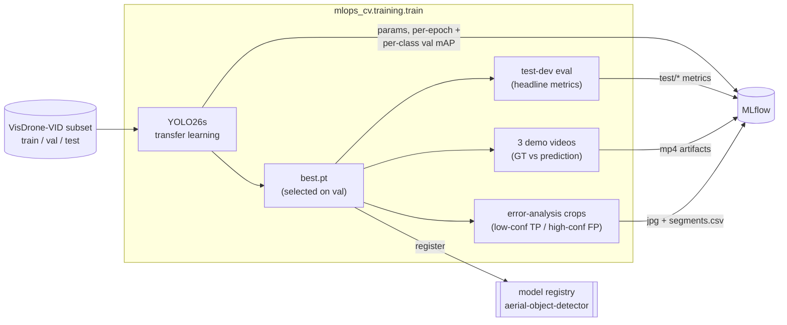

# Training (YOLO26s transfer learning)

Train **YOLO26s** on the merged 3-class VisDrone-VID subset and log everything to MLflow: the
recipe, per-epoch metrics, the held-out **test** metrics, `best.pt`, dataset lineage, three demo
videos, and a registered model version. One run is one reproducible, comparable experiment.



## Run it

```bash
make train   # brings the MLflow stack up (idempotently), then trains with the defaults
# or, with custom flags (the stack must be up — `make mlflow-up`):
uv run python -m mlops_cv.training.train --epochs 10
```

`DATA__RAW_DIR` (in `.env`) must point at the VisDrone-VID download — it supplies the raw frames for
the demo clips. CLI flags `--epochs --imgsz --batch --device --data --no-amp` override the `Settings`
defaults; the run logs to the server named by `MLFLOW__TRACKING_URI` (the local stack by default).

## What gets logged

| Logged | Source |
|---|---|
| hyperparameters | the built-in ultralytics MLflow callback |
| per-epoch losses + val `mAP50` / `mAP50-95` / P / R | built-in callback (`step` = epoch) |
| per-merged-class val mAP50-95 (`metrics/mAP50-95/<class>`) | a custom `on_fit_epoch_end` callback |
| `resolved_batch` / `accumulate` / `effective_batch` | a custom `on_train_start` callback |
| **headline `test/*` metrics** (overall + per class) | a final `val(split="test")` on the held-out test split |
| `best.pt` | logged + registered as `aerial-object-detector` |
| dataset input + `dataset_sha` | the subset `manifest.csv` |
| 3 demo videos | the GT-vs-prediction renderer (below) |
| error-analysis crops (`error_analysis/`) | low-confidence TP / high-confidence FP picks (below) |

### Validation vs test

Ultralytics selects `best.pt` by **validation** `mAP50-95` — that is model selection. The run's **headline**
metrics (`test/*`) are computed separately on a **held-out test split** (VisDrone-VID `test-dev`,
never seen in train or val), so the reported numbers reflect generalisation, not the selection set.

## Demo videos

After training, the renderer overlays **ground-truth** boxes (green) and **predictions** (red, with
confidence) on a fixed trio of held-out `test-dev` clips and encodes one `.mp4` each, logged under
the run's `demo/` artifacts. The clips are fixed (`configs/demo_clips.yaml`) so experiments stay
visually comparable, and were picked by per-class box counts so each clip stars a different class:

| Clip | Resolution | Stars |
|---|---|---|
| `uav0000161_00000_v` | 960×540 | two-three-wheeler (the rare class) |
| `uav0000355_00001_v` | 1360×765 | vehicle |
| `uav0000073_00600_v` | 1920×1080 | person (dense crowd) |

Frames are downscaled so the longest side is `≤ max_side` before inference, and encoded as **H.264**
(libx264, yuv420p) via `imageio[ffmpeg]` so they play in any standard player. `fps` is playback speed
only: VisDrone-VID stores frames indexed by number, with no source video, timestamps, or capture
rate, so the true frame rate is not recoverable.

## Error-analysis crops

Two buckets of crops surface where the freshly trained model is uncertain or wrong on the held-out
**test** split — the same visual-validation purpose as the demo videos, logged to the same run under
`error_analysis/`:

- **low-confidence true positives** — correct detections with the *smallest* confidence (near the
  decision boundary; candidates for threshold tuning or hard-example mining);
- **high-confidence false positives** — wrong detections with the *largest* confidence (the worst,
  most misleading errors, annotation issues).

Each pick is a padded, annotated crop (the box drawn with its class + confidence) indexed by
`segments.csv`. Predictions are labelled TP/FP by a greedy **per-class IoU matcher**: each prediction
(highest confidence first) claims the unused same-class ground-truth box of greatest IoU; `IoU ≥ 0.5`
is a TP (that GT is consumed), otherwise an FP.

## Scaling up

The subset is a small, strided slice for fast local iteration. To train on more data, rebuild it
with a smaller `--frame-stride` (or more sequences) and raise `--epochs`; the recipe and logging are
unchanged.
