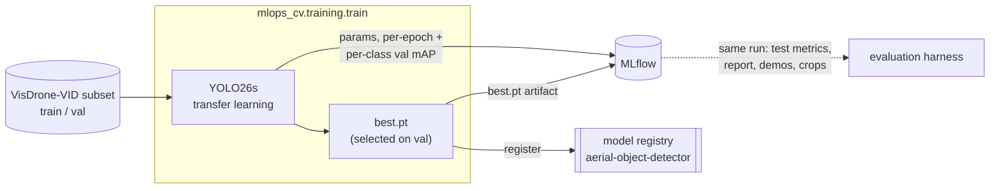

# Training (YOLO26s transfer learning)

Train **YOLO26s** on the merged 3-class VisDrone-VID subset and log the experiment to MLflow: the
recipe, per-epoch metrics, `best.pt`, dataset lineage, and a registered model version. One run is
one reproducible, comparable experiment. Training is **pure model production** — the held-out test
metrics, comparison report, and qualitative artifacts (demo videos, error-analysis crops) come from
the [evaluation harness](evaluation.md), which can log them **onto the same run** (`--run-id`).



## Run it

```bash
make mlflow-up
uv run python -m mlops_cv.training.train --epochs 10
# or with `make train` (brings the MLflow stack up idempotently)

# then evaluate the new version onto the same run (test metrics + report + visuals):
uv run python -m mlops_cv.eval.evaluate --model runs:/<run_id>/weights/best.pt --run-id=<run_id>
# or with `make eval MODEL=runs:/<run_id>/weights/best.pt RUN_ID=<run_id>`

```

CLI flags `--epochs --imgsz --batch --device --data --no-amp` override the `Settings` defaults; the
run logs to the server named by `MLFLOW__TRACKING_URI` (the local stack by default).

The process's **last stdout line** is a machine-readable handoff for orchestrators:
`{"version": "<registered version>", "run_id": "<mlflow run id>"}` — a continuous-training DAG (or
a shell script) reads it to evaluate and promote the exact version this run produced.

## What gets logged

| Logged | Source |
|---|---|
| hyperparameters | the built-in ultralytics MLflow callback |
| per-epoch losses + val `mAP50` / `mAP50-95` / P / R | built-in callback (`step` = epoch) |
| per-merged-class val mAP50-95 (`metrics/mAP50-95/<class>`) | a custom `on_fit_epoch_end` callback |
| `resolved_batch` / `accumulate` / `effective_batch` | a custom `on_train_start` callback |
| `best.pt` | logged + registered as `aerial-object-detector` |
| dataset input + `dataset_sha` | the subset `manifest.csv`; the dataset name is the subset directory's basename |

### Validation vs test

Ultralytics selects `best.pt` by **validation** `mAP50-95` — that is model selection. The
generalisation numbers (`test/*`, on the held-out split, never seen in train or val)
are computed by the [evaluation harness](evaluation.md) and can be logged onto this same
run — training itself never reads the test split.

## Scaling up

The subset is a small, strided slice for fast local iteration. To train on more data, rebuild it
with a smaller `--frame-stride` (or more sequences) and raise `--epochs`; the recipe and logging are
unchanged.
